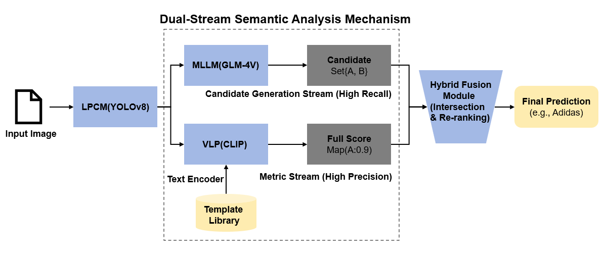
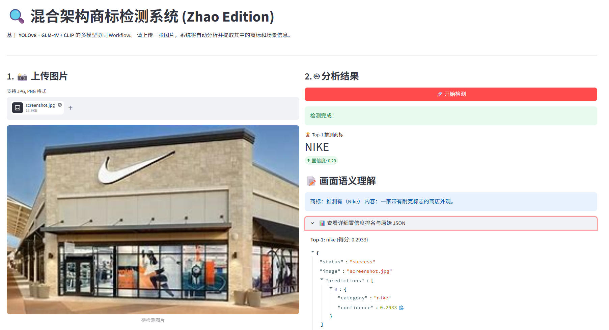

# 🚀 MultiModal-Logo-Detection

<div align="center">
<a href="https://github.com/AoT-oak/MultiModal-Logo-Detection/stargazers">
  
</a>
<a href="https://github.com/AoT-oak/MultiModal-Logo-Detection/network/members">
  
</a>
  
  
</div>


## 📋 目录

- [项目简介](#项目简介)
- [核心特性](#核心特性)
- [项目架构](#项目架构)
- [项目演示](#项目演示)
- [快速开始](#快速开始)
- [技术栈](#技术栈)
- [项目结构](#项目结构)
- [版本更迭](#版本更迭)
- [联系方式](#联系方式)

## 项目简介

本项目是一个融合了 YOLOv8 空间目标定位、大语言模型（GLM-4V）常识推理与 CLIP 零样本图文特征对齐 的混合架构智能商标检测平台。为了解决单一庞大模型容易产生幻觉且计算昂贵的痛点，本系统采用漏斗式排查机制，通过大模型圈定白名单候选集，再由 CLIP 完成高精度打分。系统不仅通过线程池并发技术实现了云端 API 与本地显卡的极限性能压榨，更独创了“商标结论+场景摘要”的双行结构化输出模式。配合前后端完全分离的微服务设计，能够为复杂图像场景提供极速、精准且易于阅读的跨模态识别服务。

## 核心特性

- **🎯 目标定位**：作为前哨，使用 YOLOv8 负责物理空间的隔离，精准提取图像中可能包含商标的 ROI 区域。
- **🧠 泛化认知**：利用智谱 GLM-4V 大视觉模型的先验知识，在给定的商标字典中圈定候选集合，大幅缩小检索范围，防止模型幻觉。
- **📏 特征对齐**：使用 CLIP 视觉-语言大模型，在候选范围内进行高精度的图文向量相似度预计算与实时匹配打分。
- **⚙️ 极速并发引擎**：通过线程池（ThreadPoolExecutor）实现 MLLM 网络请求与本地 CLIP GPU 张量计算的时间重叠，极大缩短推理延迟。
- **🛠️ 工业级解耦**：采用 FastAPI 封装标准后端微服务，提供 Streamlit 响应式交互前端，双端独立运行。

## 项目架构



## 项目演示

### AI 检测交互界面



## 快速开始

### 环境要求

| **环境** | **版本推荐** | **说明**                               |
| -------- | ------------ | -------------------------------------- |
| Python   | 3.8+         | 核心运行环境                           |
| CUDA     | 11.8 / 12.1  | 强烈推荐使用 NVIDIA 显卡以加速张量计算 |

### 克隆项目

```bash
git clone https://github.com/AoT-oak/MultiModal-Logo-Detection.git
cd MultiModal-Logo-Detection
```

### 安装依赖

项目使用专门指定 CUDA 版本的 PyTorch 源以确保最佳性能：

```bash
pip install -r requirements.txt
```

### 环境配置

系统需要调用智谱大模型（GLM-4V）提取候选集和生成自然语言描述。您需要配置 API 密钥：

**Linux / macOS:**

```bash
export ZHIPUAI_API_KEY="your_api_key_here"
```

**Windows (CMD):**

```cmd
set ZHIPUAI_API_KEY="your_api_key_here"
```
🔑 如何获取智谱 AI API Key
本项目使用智谱大模型（GLM-4V）进行视觉语义分析，您需要按照以下步骤获取您的专属 API Key：
访问官网：前往 智谱 AI 开放平台[点击这里](https://open.bigmodel.cn/)。
注册与登录：使用手机号或微信完成注册并登录。
进入控制台：点击页面右上角的 “控制台”。

查看 API Key：
在左侧菜单栏中选择 “API密钥”。
您可以直接看到默认生成的 API Key，点击 “复制” 即可。
如果没有，点击 “添加新的API密钥” 进行创建。
💡 安全提示：请妥善保管您的 API Key，不要将其直接上传到公开的 GitHub 仓库中，建议使用环境变量进行配置。

### 准备模型权重

请确保以下离线模型权重文件已放置在项目**根目录**下：

1. `best.pt`: YOLOv8 目标检测微调权重。
2. `clip-model-offline/`: Hugging Face CLIP 模型的离线完整目录，请将下载的压缩包解压后，整个文件夹放置于根目录。
您可以前往 [GitHub Releases](https://github.com/AoT-oak/MultiModal-Logo-Detection/releases) 下载，或使用百度网盘加速下载：
* 🔗 **百度网盘**: [点击这里](https://pan.baidu.com/s/1YYPejOSolF1dN-0OY7Xe5A?pwd=1234) (提取码: 1234)

### 启动服务

项目内置了针对不同操作系统的并发启动脚本（包含环境预检与端口清理）：

| **系统**      | **启动命令**                      | **后端接口端口**             | **前端 UI 端口**        |
| ------------- | --------------------------------- | ---------------------------- | ----------------------- |
| **Linux/Mac** | `chmod +x start.sh && ./start.sh` | `http://localhost:8001/docs` | `http://localhost:8501` |
| **Windows**   | 双击运行 `start.bat`              | `http://localhost:8001/docs` | `http://localhost:8501` |

## 技术栈

| **模块**         | **技术选型**         | **说明**                                   |
| ---------------- | -------------------- | ------------------------------------------ |
| **前端展示**     | Streamlit            | 快速构建响应式数据应用与模型交互界面       |
| **后端 API**     | FastAPI + Uvicorn    | 提供极高吞吐量的 ASGI 异步微服务           |
| **视觉检测**     | Ultralytics (YOLOv8) | 工业级空间目标定位与边界框裁剪             |
| **多模态大模型** | ZhipuAI (GLM-4V)     | 处理复杂场景语义，生成白名单候选与图像描述 |
| **零样本匹配**   | OpenAI CLIP          | 计算图像-文本对的余弦相似度进行高精度打分  |
| **底层框架**     | PyTorch              | 支撑深度学习模型的前向推理                 |

## 项目结构

```text
├── api_server.py          # FastAPI 异步微服务后端应用
├── app_inference.py       # 核心混合推理流水线 (单例模式统管资源)
├── app_ui.py              # Streamlit 响应式交互前端
├── categories.txt         # 商标白名单字典 (驱动 MLLM 提示词与 CLIP 预计算)
├── clip_text_analyzer.py  # CLIP 文本特征提取与打分模块
├── image_describer.py     # 图像全局语义提取模块
├── mllm_analyzer.py       # 大视觉模型 API 调用与调度模块
├── utils.py               # 通用工具函数 (模型加载等)
├── start.sh               # Linux/macOS 一键部署启动脚本
├── start.bat              # Windows 进程分离一键启动脚本
├── requirements.txt       # Python 依赖清单
├── .gitignore             # Git 忽略配置 (屏蔽模型权重与日志)
└── README.md              # 项目说明文档
注：
目录下除了以上文件，还需要包含：
best.pt( YOLOv8 目标检测微调权重。)
clip-model-offline(Hugging Face CLIP 模型的离线完整目录，请将下载的压缩包解压后，整个文件夹放置于该目录。)
```

## 版本更迭

- **v1.2.0**: [架构升级] 引入 ThreadPoolExecutor 并发控制，后端微服务化 (FastAPI) 与前端交互 (Streamlit) 彻底解耦，提供跨平台一键启动脚本。
- **v1.1.0**: [功能增强] 增强 MLLM 模块耦合度，实现全局大模型的统一参数化管控。
- **v1.0.0**: [初始版本] YOLO + MLLM + CLIP 混合检测架构核心推理逻辑打通。

## 致谢与协议

* 感谢 [Ultralytics](https://github.com/ultralytics/ultralytics) 提供的 YOLOv8 高效检测框架。 

* 感谢 [智谱 AI](https://open.bigmodel.cn/) 提供的 GLM-4V 强大视觉语义理解接口。
* 感谢 [OpenAI](https://github.com/openai/CLIP) 提供的 CLIP 零样本匹配模型。 
* 本项目遵循 [MIT License](https://opensource.org/licenses/MIT) 开源协议。

## 联系方式

如有任何问题、技术交流或实习/工作机会提供，欢迎提交 Issues 或联系作者：

- **Author**: AoT-oak
- **Email**: m13043736284@163.com
- **GitHub**: https://github.com/AoT-oak
